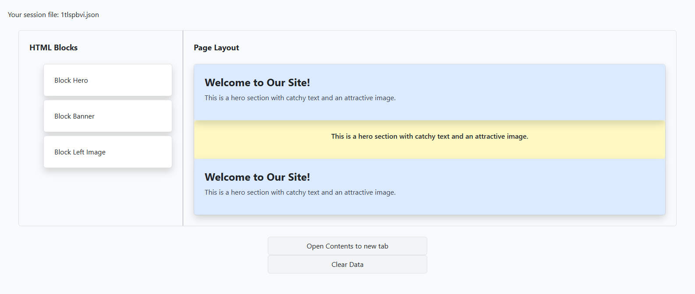

# CMS Page Builder

- This is a CMS page builder. A Practical example of drag and drop feature important when building something like a CMS (Content Management System).
- The example is using a tailwindcss for styling.
- This is also mixed with bootstrap for modal. Though this is not recommended. I just needed the modal functionality of bs.
- This is a working example with few server-side codes to process and render the page and blocks.
- It uses the [SortableJS](https://github.com/SortableJS/Sortable) package.

## Cloning and Testing

- You can just simply clone the project to try it for yourself.
- You need a wamp or xampp because the example is in .php.
- `git clone https://github.com/dvxgit-jsoriano/PHP-PracticalExample-DragAndDropBlocks.git`
- Test it. `http://localhost/PHP-PracticalExample-DragAndDropBlocks`

## Sample Screenshots
- You can drag from the left blocks selection, then drop to the right contents panel.
- You may also click the "Open Contents to new tab", to view your changes.
- You can clear data to renew your session. It will generate new session number for you.
- 